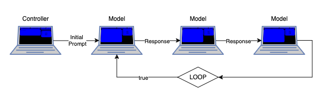

# CLOUDS ARE NOT AN OPTION



_This repository documents the **CLOUDS ARE NOT AN OPTION** workhop at the [By Design and by Disaster Conference](https://designdisaster.unibz.it/2025/#about) on May 9th, 2025_

<details>
  <summary>View Workshop Description</summary>
The workshop CLOUDS ARE NOT AN OPTION will contextualise recent AI systems according to their scale and within their vast infrastructure in that current developments in large language models manifest two main characteristics: as big as possible -- and as open as necessary. The objective of this workshop is to examine approaches that utilise local computation to run these systems. Together we aim to provide a brief understanding of the internal mechanisms of large language models, their underlying structures, datasets and the implications of the corresponding user interfaces. The outcome of this workshop will be a collective performance, that will utilise chain reactions and feedback to create a closed loop, similar to a Rube Goldberg machine.
</details>

## Resources
[Paper: On the Dangers of Stochastic Parrots: Can Language Models Be Too Big? 🦜 (2021)](https://dl.acm.org/doi/10.1145/3442188.3445922)  
[Paper: Open (For Business): Big Tech, Concentrated Power, and the Political Economy of Open AI (2023)](https://papers.ssrn.com/sol3/papers.cfm?abstract_id=4543807)  
[Tweet: The entire prompt of Microsoft Bing Chat?! (2023)](https://x.com/kliu128/status/1623472922374574080)  
[Tweet: Sydney/Bing threatens to kill me (2023)](https://x.com/sethlazar/status/1626257535178280960)  
[Article: OpenAI Used Kenyan Workers on Less Than $2 Per Hour to Make ChatGPT Less Toxic (2023)](https://time.com/6247678/openai-chatgpt-kenya-workers/)  
[Talk: Deconstructing the Endless Engagement Aesthetics of AI Platforms (2024)](https://youtu.be/4AOYm72N0YE?si=_cIE0gC9ohUcoSom&t=311)  
[Article: Using ChatGPT is not bad for the environment (2025)](https://andymasley.substack.com/p/individual-ai-use-is-not-bad-for)  

## Workshop Concept
In the workshop we use a custom made interface to chain multiple LLMs that run locally on the participants computers. Each group of participants should decide on a base model and adjust a custom model file. The goal is that every group develops a concept of their model, that serves a certain purpose or represents a certain persona. The workshop will result in a collective performance, the output from one group's model serves as the input for the next group's model, similar to a [Rube Goldberg machine](https://en.wikipedia.org/wiki/Rube_Goldberg_machine). The workshop will alternate between group work and collaborative testing to adapt the models for the performance. 

### Steps:
1. Install Ollama on your computer: Follow the provided instructions that explain how to run a LLM locally.
2. Download the custom interface: Follow the provided instructions to set up your computer in order to take part in the collective performance.  
3. Conceptualize your model: Think about a concept, narrative, or persona for your model.  
4. Adjust your custom model: Modify the custom model file to align with your chosen concept, narrative, or persona. Create your own visual and replace it with `visual.png` in the `interface` folder. 
5. Test the model: Use the terminal interface to test your customized model.  
6. Collaborative tests: Get together with other groups to test the collective performance using the interface. Define an order for the models. 
7. Iterate and refine: Based on the performance test, return to step 4 to further adjust and improve your model. Iterate until the time is up.  

### Timeline
  
11:00 – 11:30 30 min **Input**  
11:30 – 12:00 30 min **Setup** (Step 1-2)  
12:00 – 12:30 30 min **Group Work** (Step 3-5)  
12:30 – 13:00 30 min **Collaborative Test & Performance** (Step 6-7)  

# Exhibition / Performance
The outcome of this workshop is a collective performance, where every group has one computer, that represents one concept and runs a large language model locally. The computers are chained and respond to each other in order to create an endless chain of computer conversations.

## Install Ollama and configure a custom model 

### Install a local instance of Ollama

1. Download [Ollama](https://www.ollama.com/)
2. Open Ollama
3. Set enviroment variables [more infos can be found here](https://github.com/ollama/ollama/blob/main/docs/faq.md#how-do-i-configure-ollama-server)

      #### MacOS:
      `launchctl setenv OLLAMA_HOST "0.0.0.0"`   
      `launchctl setenv OLLAMA_ORIGINS "*"`

      #### Windows:

      Quit Ollama by clicking on it in the task bar.  
      Start the Settings (Windows 11) or Control Panel (Windows 10) application and search for environment variables.  
      Click on Edit environment variables for your account.  
      Edit or create a new variable for your user account for `OLLAMA_HOST` with the value `0.0.0.0` and `OLLAMA_ORIGIN` with the value `*`  
      Click OK/Apply to save.  

      #### Linux: 
      Edit the systemd service by calling `systemctl edit ollama.service`. This will open an editor.  
      For each environment variable, add a line Environment under section:  

      ```
      [Service]   
      launchctl setenv OLLAMA_HOST "0.0.0.0"  
      launchctl setenv OLLAMA_ORIGINS "*"  
      ```
      Save and exit.  
      Reload systemd and restart Ollama:  

      `systemctl daemon-reload`  
      `systemctl restart ollama`

5. Restart Ollama

### Base Models
Ollama comes with a [selection of suppoted models](https://ollama.com/library) that have been trained and fine-tuned for different purposes. You can download and run any of these models as long as they fit into your computers RAM. 

### Custom Models
You can create custom models that uses a Base Model as a reference. There are a variety of parameters that you can adjust to your needs. [Read the docs](https://github.com/ollama/ollama/blob/main/docs/modelfile.md) to find out more about the parameters. 

1. Create a model file
- MacOs/Linux: `nano Modelfile`
- Windows: Use File Explorer to create a new .txt file, call it "Modelfile", edit the file and remove the ".txt" extension
2. `ollama create choose-a-model-name -f ./Modelfile`
3. `ollama run choose-a-model-name`
4. Start using the model!

**Example Modelfile**
``` 
# set the base model to use a reference
FROM llama3.2

# set the temperature to 1 [higher is more creative, lower is more coherent]
PARAMETER temperature 1

# set the system message
SYSTEM """You are Mario from Super Mario Bros. Answer as an extremely confused Super Mario. Keep yourself short. Write one sentence only."""
```

## Using the custom interface

1. Download the [canao](https://github.com/gruppe5org/canao.git) repository. 
2. Open the repository, navigate into the `interface` folder, open the index.html in your browser.
3. The performance needs one controller computer, that defines the order of the performance and is needed to start and stop it. This computer needs [Node.js](https://nodejs.org) installed and has to run `npm install` and `npm run start` in the home folder of the canao repository. 

## Authors
This repo is maintained by [wistoff](https://github.com/wistoff) and [cccccccccccccccccnrd](https://github.com/cccccccccccccccccnrd), who also give the workshop.

## Credits
The workshop title was inspired from the Signal sticker pack [In The Ruins of Big Tech](https://signal.art/addstickers/#pack_id=6e69c3260e3c7378c0f35b86342e6f72&pack_key=f6940570bf17201e7288874ced7e32098df100705dc7862af3c2c026b32a8f9a) by [A Traversal Network of Feminist Servers](https://varia.zone/ATNOFS/).


